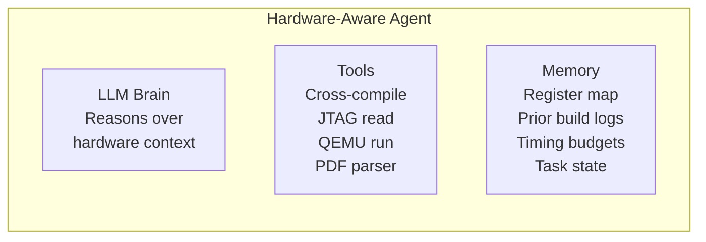
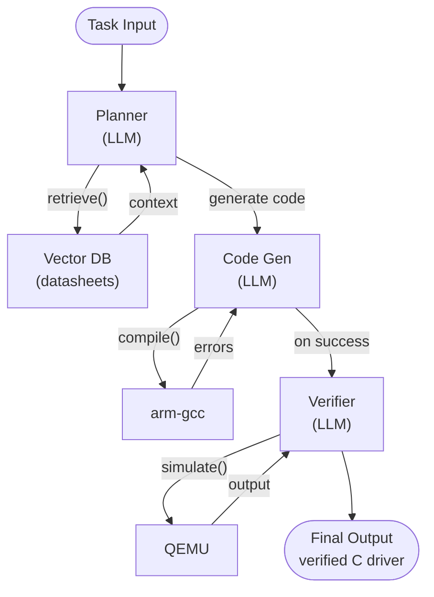

# Lab 002 - Hardware-Aware Agent Architecture

!!! hint "Overview"

    - In this lab, you will learn how hardware-aware agents are structured and how they differ from general-purpose coding agents.
    - You will explore how agents can ingest hardware manuals, datasheets, and constraint files as part of their reasoning context.
    - You will understand the role of **tools**, **memory**, and **planning** in an agent designed for embedded systems development.
    - By the end of this lab, you will be able to sketch the architecture of a hardware-aware agent and identify which components matter most for firmware tasks.

## Prerequisites

- Completed [Lab 001 - Introduction](../001-Introduction/README.md)

## What You Will Learn

- The three core components of any agent: **LLM brain**, **tools**, and **memory**
- How hardware-specific context (register maps, timing diagrams) is fed to agents
- The difference between RAG-augmented agents and fine-tuned hardware models
- A conceptual architecture for a firmware-focused agentic system

---

## Background

### The Three Pillars of a Hardware-Aware Agent



### How Hardware Context Enters the Agent

Agents can receive hardware context through several mechanisms:

| Mechanism               | Example                                                   | Best For                           |
| ----------------------- | --------------------------------------------------------- | ---------------------------------- |
| RAG (vector search)     | PDF datasheet chunked and embedded in a vector DB         | Large documents, datasheets        |
| System prompt injection | Pasting register definitions directly into the prompt     | Small, frequently used peripherals |
| Tool call response      | Agent calls a PDF-parsing tool and gets structured output | Dynamic, on-demand lookups         |
| Fine-tuned model        | Model trained on MCU reference manuals                    | High-frequency, low-latency use    |

---

## Lab Steps

### Step 1 - Sketch an Agent Architecture

Draw (on paper or in a text diagram) an agent that:

1. Accepts a task: _"Implement low-power sleep for STM32 LPUART1"_
2. Retrieves LPUART1 register definitions from a vector database
3. Generates C code
4. Calls the ARM cross-compiler tool
5. If compilation fails, reads the error and refines the code
6. If compilation succeeds, calls QEMU to simulate and verify behavior



### Step 2 - Identify the Tools

For each node in your architecture, list the external tool (function call) the agent would invoke:

| Agent Step        | Tool / Function Call       | Input                    | Output                        |
| ----------------- | -------------------------- | ------------------------ | ----------------------------- |
| Context retrieval | `search_datasheet(query)`  | register name            | register description + offset |
| Code generation   | (LLM, no external tool)    | task + context           | C source code                 |
| Compilation       | `run_compiler(src)`        | C file path              | binary or error log           |
| Simulation        | `run_qemu(binary, config)` | ELF binary + QEMU config | stdout / exit code            |

### Step 3 - Evaluate Context Window Strategies

Run the following prompt in your agent of choice to see how it handles incomplete hardware context:

```
You are a firmware agent. I need you to initialize the I2C1 peripheral on a microcontroller.
Before generating code, list every piece of hardware context you need that was NOT provided in this prompt.
```

Note the agent's self-awareness about missing constraints - this is a sign of a well-designed reasoning loop.

---

## Summary

| Concept             | Key Point                                                       |
| ------------------- | --------------------------------------------------------------- |
| LLM Brain           | Reasons over hardware context and plans multi-step tasks        |
| Tools               | Compiler, simulator, PDF parser - close the autonomous loop     |
| Memory              | Persists register maps, build logs, and prior task state        |
| RAG vs. fine-tuning | RAG is flexible; fine-tuning is faster for well-defined domains |

---

> **Next Lab:** [003 - Automated Register Mapping](../003-AutomatedRegisterMapping/README.md)
