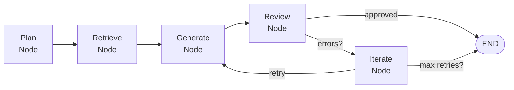

# Lab 006 - Agentic Frameworks - LangGraph

!!! hint "Overview"

    - Agentic AI Foundations for R&D (FW Module)** - 8-hour Academic Intensive.
    - In this lab, you will build a **stateful LangGraph agent** that reasons before writing firmware code.
    - You will understand how LangGraph's state machine model enables agents to plan, reflect, and iterate - not just generate tokens once.
    - By the end of this lab, you will have a working LangGraph agent that accepts a firmware task, reasons about hardware constraints, and produces verified C code.

## Prerequisites

- Completed [Lab 005 - Agentic JTAG Debugging](../005-AgenticDebugging/README.md)
- Python 3.10+ installed
- `langgraph`, `langchain-openai`, `openai` Python packages

```bash
pip install langgraph langchain-openai openai
```

## What You Will Learn

- The LangGraph programming model: **nodes**, **edges**, and **state**
- How to build a firmware agent with a **plan → generate → review** loop
- How to add a "reasoning" node that checks hardware constraints before generating code
- How to integrate human-in-the-loop checkpoints for critical firmware decisions

---

## Background

### Why LangGraph for Firmware?

A simple LLM call is stateless - each call is independent. For firmware tasks, an agent may need to:

1. **Plan:** Identify which registers and clocks are involved
2. **Retrieve:** Look up relevant peripheral configuration from context
3. **Generate:** Write C code
4. **Verify:** Check timing math or compilation result
5. **Iterate:** Fix errors and retry

LangGraph models this as a graph of nodes, where **state** is carried between nodes:



---

## Lab Steps

### Step 1 - Install and Verify Dependencies

```bash
python -c "import langgraph; import langchain_openai; print('OK')"
```

### Step 2 - Define the Agent State

```python
from typing import TypedDict, Optional

class FirmwareAgentState(TypedDict):
    task: str                   # Original task description
    hardware_context: str       # Peripheral / register context
    plan: str                   # Agent's reasoning plan
    generated_code: str         # Generated C code
    review_notes: str           # Review feedback
    iteration: int              # Current retry count
    final_code: Optional[str]   # Verified final output
```

### Step 3 - Build the LangGraph Nodes

```python
from langchain_openai import ChatOpenAI
from langgraph.graph import StateGraph, END
from firmware_agent_state import FirmwareAgentState

llm = ChatOpenAI(model="gpt-4o", temperature=0)

def plan_node(state: FirmwareAgentState) -> FirmwareAgentState:
    """Reason about the task before generating any code."""
    prompt = f"""
You are a firmware planning agent.
Task: {state['task']}
Hardware Context: {state['hardware_context']}

Before writing any code, produce a structured plan:
1. List every register that must be configured
2. Identify any timing constraints
3. Identify any power-state dependencies
4. State the order of initialization steps
"""
    plan = llm.invoke(prompt).content
    return {**state, "plan": plan}

def generate_node(state: FirmwareAgentState) -> FirmwareAgentState:
    """Generate C firmware code based on the plan."""
    prompt = f"""
You are a firmware code generation agent.
Task: {state['task']}
Hardware Context: {state['hardware_context']}
Plan: {state['plan']}
{"Previous Review Notes: " + state['review_notes'] if state.get('review_notes') else ""}

Generate complete, production-quality C code.
Include register-level comments for every write.
"""
    code = llm.invoke(prompt).content
    return {**state, "generated_code": code, "iteration": state.get("iteration", 0) + 1}

def review_node(state: FirmwareAgentState) -> FirmwareAgentState:
    """Review the generated code for correctness."""
    prompt = f"""
You are a firmware code review agent.
Review the following generated code against the hardware context.
Check for:
- Incorrect register offsets or bit positions
- Missing clock enables before peripheral access
- Uninitialized variables or missing return values
- Potential race conditions or unsafe operations

Generated Code:
{state['generated_code']}

Hardware Context:
{state['hardware_context']}

If the code is correct, reply with only: APPROVED
If there are issues, list them clearly.
"""
    review = llm.invoke(prompt).content
    return {**state, "review_notes": review}

def route_after_review(state: FirmwareAgentState) -> str:
    """Route to END if approved, or back to generate if fixes needed."""
    if "APPROVED" in state["review_notes"]:
        return "finalize"
    if state.get("iteration", 0) >= 3:
        return "finalize"  # Max retries reached
    return "generate"

def finalize_node(state: FirmwareAgentState) -> FirmwareAgentState:
    return {**state, "final_code": state["generated_code"]}

# Build the graph
graph = StateGraph(FirmwareAgentState)
graph.add_node("plan", plan_node)
graph.add_node("generate", generate_node)
graph.add_node("review", review_node)
graph.add_node("finalize", finalize_node)

graph.set_entry_point("plan")
graph.add_edge("plan", "generate")
graph.add_edge("generate", "review")
graph.add_conditional_edges("review", route_after_review, {
    "generate": "generate",
    "finalize": "finalize"
})
graph.add_edge("finalize", END)

agent = graph.compile()
```

### Step 4 - Run the Agent on a Firmware Task

```python
result = agent.invoke({
    "task": "Initialize SPI1 on STM32F4 in Master mode at 1 MHz, 8-bit data, CPOL=0 CPHA=0",
    "hardware_context": """
SPI1 Base Address: 0x40013000
APB2 bus clock: 84 MHz
RCC_APB2ENR bit 12: SPI1EN

SPI_CR1 Register (offset 0x00):
  Bit 11: DFF - Data Frame Format (0=8-bit, 1=16-bit)
  Bit 9:  SSM - Software Slave Management
  Bit 8:  SSI - Internal Slave Select
  Bit 6:  SPE - SPI Enable
  Bits 5:3 BR[2:0] - Baud Rate Prescaler (000=fPCLK/2 ... 111=fPCLK/256)
  Bit 2:  CPOL - Clock Polarity
  Bit 1:  CPHA - Clock Phase
  Bit 0:  CPHA
""",
    "plan": "",
    "generated_code": "",
    "review_notes": "",
    "iteration": 0,
    "final_code": None
})

print(result["final_code"])
```

### Step 5 - Add a Human-in-the-Loop Checkpoint

```python
from langgraph.checkpoint.memory import MemorySaver

memory = MemorySaver()
agent_with_checkpoint = graph.compile(
    checkpointer=memory,
    interrupt_before=["generate"]  # pause before code generation for human review
)

# The agent will pause at the "generate" node and wait for human approval
```

---

## Summary

| Skill                 | What You Practiced                                           |
| --------------------- | ------------------------------------------------------------ |
| LangGraph state model | Defining TypedDict state and wiring nodes/edges              |
| Plan–Generate–Review  | Multi-step reasoning loop for firmware tasks                 |
| Conditional routing   | APPROVED vs. retry logic in edge conditions                  |
| Human-in-the-loop     | Interrupt-before checkpoints for critical firmware decisions |

---

> **Next Lab:** [007 - Self-Healing FW Workflows](../007-SelfHealingWorkflows/README.md)
