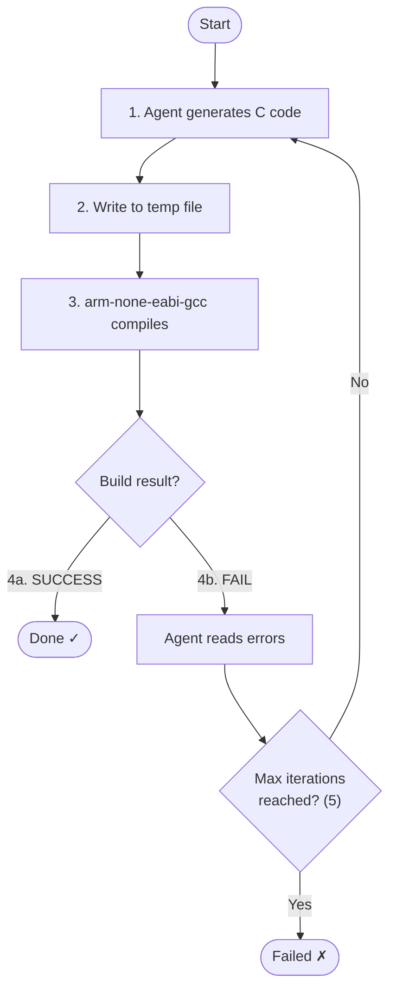

# Lab 007 - Self-Healing FW Workflows

!!! hint "Overview"

    - Agentic AI Foundations for R&D (FW Module)** - Self-Healing FW Workflows module.
    - In this lab, you will build an autonomous loop where an agent **writes code → runs the cross-compiler → analyzes build errors → iterates** until the firmware builds successfully.
    - You will integrate a real ARM cross-compiler (`arm-none-eabi-gcc`) as an agent tool, giving the agent genuine feedback from the hardware toolchain.
    - By the end of this lab, you will have a self-healing pipeline that can take a high-level firmware description and produce a compilable implementation without human intervention on build errors.

## Prerequisites

- Completed [Lab 006 - Agentic Frameworks - LangGraph](../006-AgenticFrameworks/README.md)
- `arm-none-eabi-gcc` installed (or use a Docker container with ARM toolchain)
- Python `subprocess` module (standard library - no extra install required)

```bash
# Verify toolchain
arm-none-eabi-gcc --version
```

## What You Will Learn

- How to wrap the ARM cross-compiler as an agent tool
- How to parse GCC error output and feed it back to the LLM for correction
- How to set maximum iteration limits to prevent infinite loops
- How to handle common firmware build errors (missing headers, redefined symbols, linker errors)

---

## Background

### The Build Loop

A self-healing firmware agent operates a deterministic loop:



This is the same loop a junior engineer performs manually - the agent just runs it in seconds.

---

## Lab Steps

### Step 1 - Build the Compiler Tool

```python
import subprocess
import tempfile
import pathlib

ARM_GCC = "arm-none-eabi-gcc"
COMPILE_FLAGS = [
    "-mcpu=cortex-m4",
    "-mthumb",
    "-mfpu=fpv4-sp-d16",
    "-mfloat-abi=hard",
    "-Os",
    "-Wall",
    "-Werror",
    "-nostdlib",
    "-c",   # compile only, no link
]

def compile_firmware(c_source: str, include_paths: list[str] = None) -> dict:
    """
    Compile C source code using arm-none-eabi-gcc.
    Returns {"success": bool, "output": str}
    """
    include_flags = [f"-I{p}" for p in (include_paths or [])]

    with tempfile.NamedTemporaryFile(suffix=".c", mode="w", delete=False) as f:
        f.write(c_source)
        src_file = f.name

    out_file = src_file.replace(".c", ".o")

    cmd = [ARM_GCC] + COMPILE_FLAGS + include_flags + ["-o", out_file, src_file]
    result = subprocess.run(cmd, capture_output=True, text=True)

    pathlib.Path(src_file).unlink(missing_ok=True)
    pathlib.Path(out_file).unlink(missing_ok=True)

    return {
        "success": result.returncode == 0,
        "output": result.stdout + result.stderr
    }
```

### Step 2 - Build the Self-Healing Agent

```python
import openai

client = openai.OpenAI()
MAX_ITERATIONS = 5

def self_healing_fw_agent(task: str, context: str) -> str:
    """
    Autonomously generate, compile, and fix firmware until build succeeds.
    Returns the final compilable C source code.
    """
    messages = [
        {
            "role": "system",
            "content": (
                "You are a firmware code generation agent for ARM Cortex-M targets. "
                "Generate production-quality C code. "
                "When given compiler errors, fix them and return only the corrected C code. "
                "Do not include markdown fences or explanations - return raw C source only."
            )
        },
        {
            "role": "user",
            "content": f"Task: {task}\n\nHardware Context:\n{context}"
        }
    ]

    for iteration in range(1, MAX_ITERATIONS + 1):
        print(f"\n[Iteration {iteration}] Generating code...")

        response = client.chat.completions.create(
            model="gpt-4o",
            messages=messages
        )
        code = response.choices[0].message.content

        print(f"[Iteration {iteration}] Compiling...")
        result = compile_firmware(code)

        if result["success"]:
            print(f"[Iteration {iteration}] BUILD SUCCESS after {iteration} iteration(s)")
            return code
        else:
            print(f"[Iteration {iteration}] BUILD FAILED:\n{result['output']}")
            messages.append({"role": "assistant", "content": code})
            messages.append({
                "role": "user",
                "content": (
                    f"The code failed to compile with the following errors:\n\n"
                    f"{result['output']}\n\n"
                    "Fix all errors and return the corrected C source code only."
                )
            })

    print(f"[FAILED] Could not produce compilable code after {MAX_ITERATIONS} iterations")
    return code  # Return last attempt
```

### Step 3 - Run the Self-Healing Pipeline

```python
task = """
Write a C function void SPI1_Init(void) for an STM32F4.
The function must:
1. Enable SPI1 clock via RCC->APB2ENR
2. Configure SPI1->CR1 for:
   - Master mode (MSTR=1)
   - Baud rate fPCLK/8 (BR=010)
   - 8-bit data frame (DFF=0)
   - Software NSS (SSM=1, SSI=1)
   - CPOL=0, CPHA=0
3. Enable SPI (SPE=1)
"""

context = """
#include <stdint.h>

typedef struct {
    volatile uint32_t CR1;
    volatile uint32_t CR2;
    volatile uint32_t SR;
    volatile uint32_t DR;
} SPI_TypeDef;

typedef struct {
    volatile uint32_t APB2ENR;
} RCC_TypeDef;

#define RCC_BASE    0x40023800UL
#define SPI1_BASE   0x40013000UL
#define RCC         ((RCC_TypeDef *)RCC_BASE)
#define SPI1        ((SPI_TypeDef *)SPI1_BASE)
#define RCC_APB2ENR_SPI1EN  (1U << 12)
"""

final_code = self_healing_fw_agent(task, context)
print("\n=== FINAL CODE ===")
print(final_code)
```

### Step 4 - Extend: Add Linker Error Handling

Add a second compile phase that links against a minimal startup file:

```python
LINKER_SCRIPT = """
MEMORY {
    FLASH (rx)  : ORIGIN = 0x08000000, LENGTH = 512K
    RAM   (rwx) : ORIGIN = 0x20000000, LENGTH = 128K
}
SECTIONS {
    .text : { *(.text*) } > FLASH
    .data : { *(.data*) } > RAM AT > FLASH
    .bss  : { *(.bss*)  } > RAM
}
"""

def link_firmware(obj_files: list[str], linker_script: str) -> dict:
    """Link object files against a linker script."""
    import tempfile
    with tempfile.NamedTemporaryFile(suffix=".ld", mode="w", delete=False) as f:
        f.write(linker_script)
        ld_file = f.name

    out_elf = ld_file.replace(".ld", ".elf")
    cmd = [ARM_GCC, "-T", ld_file, "-nostdlib", "-o", out_elf] + obj_files
    result = subprocess.run(cmd, capture_output=True, text=True)

    pathlib.Path(ld_file).unlink(missing_ok=True)
    pathlib.Path(out_elf).unlink(missing_ok=True)

    return {"success": result.returncode == 0, "output": result.stdout + result.stderr}
```

---

## Summary

| Skill                  | What You Practiced                                     |
| ---------------------- | ------------------------------------------------------ |
| Compiler tool wrapping | Calling arm-none-eabi-gcc from Python as an agent tool |
| Error-feedback loop    | Passing GCC errors back to LLM for autonomous fixing   |
| Iteration limits       | Preventing runaway loops with max-retry guards         |
| Linker integration     | Extending from compile-only to full link pipeline      |

---

> **Next Lab:** [008 - Security & Safety for Firmware](../008-SecuritySafety/README.md)
