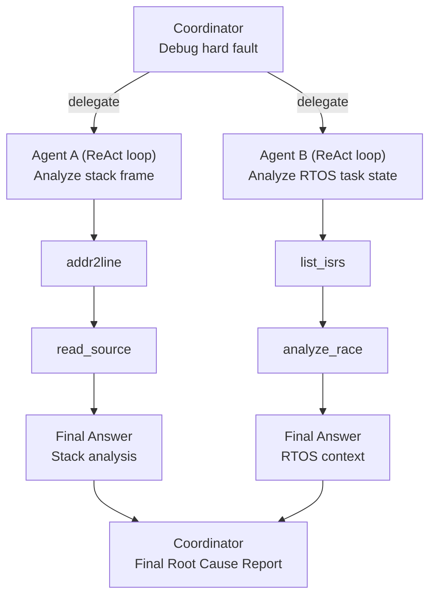

# Lab 012 - ReAct Patterns for HW-SW Debugging

!!! hint "Overview"

    - Applied Agents for Hardware-Software R&D** - Reasoning Patterns module.
    - In this lab, you will implement the **ReAct (Reason + Act)** prompting pattern specifically for debugging hardware-software synchronization issues.
    - ReAct gives agents an explicit reasoning trace - each action is preceded by a thought - making the debugging process transparent and auditable.
    - By the end of this lab, you will be able to build and run a ReAct firmware debugging agent that narrates its reasoning while working through real hardware-software concurrency bugs.

## Prerequisites

- Completed [Lab 011 - Tool-Use & Function Calling](../011-ToolUseFunctionCalling/README.md)
- Python 3.10+ with `langchain` or `openai` installed

## What You Will Learn

- The ReAct (Reason → Act → Observe) prompting pattern
- How to apply ReAct to hardware-software synchronization debugging
- How to build a multi-step reasoning chain for race condition analysis
- How to make the agent's reasoning trace visible and auditable

---

## Background

### The ReAct Pattern

Standard prompting asks the agent to jump straight to an answer. ReAct adds an explicit thought step:

```
Thought: [reason about the current state]
Action:  [select a tool or action to take]
Observation: [result of the action]
... (repeat until done)
Final Answer: [conclusion]
```

For firmware debugging, this maps naturally to the engineering debugging process:

```
Thought: The crash occurs at 0x08012A48. I need to find what function is at that address.
Action:  addr2line(0x08012A48, firmware.elf)
Observation: uart.c:142, inside UART_SendBuffer

Thought: UART_SendBuffer at line 142 - let me check if there's a buffer overflow there.
Action:  read_source(uart.c, 135, 150)
Observation: [source code lines 135-150]

Thought: I can see strcpy without bounds check on line 141. This is the root cause.
Final Answer: Buffer overflow in UART_SendBuffer() at uart.c:141 due to unbounded strcpy.
```

### Why ReAct for Hardware Debugging?

Hardware-software bugs often involve:

- **Multi-layer causality** - the crash site is not the bug origin
- **Timing dependencies** - the bug only occurs in a specific interrupt interleaving
- **State-space complexity** - dozens of registers contribute to the faulty state

ReAct forces the agent to reason through each layer explicitly, producing an auditable chain of evidence rather than a guess.

---

## Lab Steps

### Step 1 - Implement a ReAct Firmware Debugger

```python
import openai
import re
import json

client = openai.OpenAI()

REACT_SYSTEM_PROMPT = """
You are a firmware debugging agent using the ReAct (Reason + Act) methodology.

For every debugging step, follow this format EXACTLY:

Thought: [Your reasoning about what you know and what you need to find out next]
Action: tool_name({"param": "value"})
Observation: [Result of the tool call - filled in by the system]

Continue Thought/Action/Observation cycles until you have identified the root cause.

Then, and only then, write:
Final Answer: [Clear root cause statement and recommended fix]

Available tools:
- addr2line({"address": "0x...", "elf": "path/to/firmware.elf"}) → function and line
- read_source({"file": "uart.c", "start_line": 100, "end_line": 120}) → source lines
- list_isrs({"elf": "path/to/firmware.elf"}) → all interrupt handler function names and addresses
- analyze_race({"task_a": "...", "task_b": "...", "shared_resource": "..."}) → race condition analysis
"""

def parse_action(response_text: str) -> tuple[str | None, dict | None]:
    """Extract Action: tool_name({...}) from agent output."""
    match = re.search(r'Action:\s*(\w+)\((\{.*?\})\)', response_text, re.DOTALL)
    if match:
        tool_name = match.group(1)
        args = json.loads(match.group(2))
        return tool_name, args
    return None, None

def is_final(response_text: str) -> bool:
    return "Final Answer:" in response_text

# Mock tool implementations (replace with real tools from Lab 011)
def addr2line(address: str, elf: str) -> str:
    # Simulated - returns mock result
    mock = {
        "0x08012A48": "uart.c:142, function UART_SendBuffer",
        "0x08012A05": "uart.c:128, function UART_Init"
    }
    return mock.get(address, f"Address {address} not found in {elf}")

def read_source(file: str, start_line: int, end_line: int) -> str:
    return (
        f"[{file}:{start_line}-{end_line}]\n"
        "...simulated source lines...\n"
        f"Line 141: strcpy(pkt.command, input);  // no bounds check\n"
        f"Line 142: UART_SendBuffer(pkt.command, strlen(pkt.command));\n"
    )

MOCK_TOOLS = {
    "addr2line": addr2line,
    "read_source": read_source,
}

def run_react_debugger(bug_report: str) -> str:
    messages = [
        {"role": "system", "content": REACT_SYSTEM_PROMPT},
        {"role": "user", "content": f"Debug the following firmware crash:\n\n{bug_report}"}
    ]

    for _ in range(10):  # Max 10 ReAct cycles
        response = client.chat.completions.create(
            model="gpt-4o",
            messages=messages
        )
        text = response.choices[0].message.content
        print(f"\n{text}")
        messages.append({"role": "assistant", "content": text})

        if is_final(text):
            break

        tool_name, args = parse_action(text)
        if tool_name and tool_name in MOCK_TOOLS:
            observation = MOCK_TOOLS[tool_name](**args)
            messages.append({
                "role": "user",
                "content": f"Observation: {observation}"
            })
        else:
            messages.append({
                "role": "user",
                "content": "Observation: Tool not available or malformed action."
            })

    return text
```

### Step 2 - Run the ReAct Debugger on a Hard Fault

```python
bug_report = """
System: STM32H7 running FreeRTOS
Symptom: Hard Fault crash, PC = 0x08012A48, LR = 0x08012A05
Firmware ELF: build/firmware.elf

CFSR = 0x00008200
  BFSR: PRECISERR=1, BFARVALID=1
  BFAR = 0x40013804

The crash happens reliably when the UART transmission path is active
and a large command string (>80 characters) is received over UART2.
"""

result = run_react_debugger(bug_report)
```

### Step 3 - Apply ReAct to HW-SW Synchronization

Run the debugger on a more complex multi-task synchronization scenario:

```python
sync_bug = """
System: STM32F4 + FreeRTOS, 3 tasks: SensorTask, ProcessTask, CommTask
Symptom: CommTask occasionally sends zeros instead of valid sensor readings.
         The bug is non-deterministic and requires ~30 minutes to reproduce.

Stack sizes: all tasks at 512 words (2KB)
Shared data: sensor_data_t global struct, 48 bytes, no mutex protection
SensorTask priority: 3 (highest)
ProcessTask priority: 2
CommTask priority: 1 (lowest)

CommTask reads sensor_data directly between ProcessTask writes.
No RTOS primitives protect the shared struct.

The bug appeared after SensorTask sample rate was increased from 10 Hz to 100 Hz.
"""

run_react_debugger(sync_bug)
```

### Step 4 - Multi-Agent ReAct for Parallel Investigation

Build a two-agent setup where a **Coordinator** delegates sub-investigations to **Specialist** agents:



---

## Summary

| Skill                    | What You Practiced                                            |
| ------------------------ | ------------------------------------------------------------- |
| ReAct pattern            | Thought → Action → Observation cycles for firmware debugging  |
| Transparent reasoning    | Agent narrates its reasoning trace at each debugging step     |
| Multi-layer root cause   | Following causality from crash site back to original bug      |
| Multi-agent coordination | Coordinator delegating parallel investigations to specialists |

---

> **Next Lab:** [013 - Agentic Documentation](../013-AgenticDocumentation/README.md)
