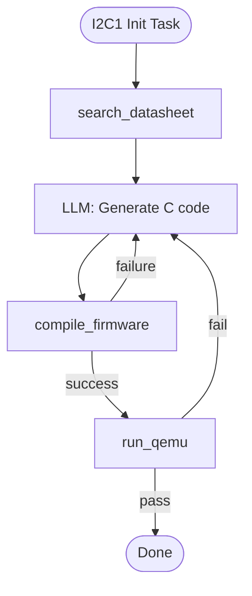

# Lab 002 - Hardware-Aware Agents Tasks

- Exercises covering agent architecture, context injection strategies, and hardware-specific reasoning.
- Each task includes a description, scenario, hint, and collapsible Solution.

#### Table of Contents

- [01. Identify the Three Pillars](#01-identify-the-three-pillars)
- [02. Choose the Right Context Injection Method](#02-choose-the-right-context-injection-method)
- [03. Design a Minimal Hardware-Aware Agent](#03-design-a-minimal-hardware-aware-agent)
- [04. Evaluate Context Window Completeness](#04-evaluate-context-window-completeness)

---

#### 01. Identify the Three Pillars

For each of the following agent descriptions, identify which of the three pillars (**LLM Brain**, **Tools**, **Memory**) is missing or weakest. Explain the consequence.

1. An agent that generates register initialization code entirely from its training knowledge, with no access to any datasheet or PDF.
2. An agent with a large vector DB of MCU manuals, but no ability to call a compiler or simulator.
3. An agent that can compile code and run QEMU, but forgets the result of the previous build iteration on each new query.

#### Scenario:

◦ An embedded team is debugging why their firmware agent keeps generating code that compiles but fails in simulation.
◦ Understanding which pillar is weak helps them prioritize architectural improvements.

**Hint:** Review the three-pillar diagram in Lab 002.

<details markdown>
<summary>Solution</summary>

| #   | Missing/Weak Pillar                        | Consequence                                                                                                               |
| --- | ------------------------------------------ | ------------------------------------------------------------------------------------------------------------------------- |
| 1   | **Memory** (hardware context)              | Agent hallucinates register offsets or bit positions that differ from the real datasheet → silent functional errors.      |
| 2   | **Tools**                                  | Agent can reason about firmware but cannot verify it compiles or runs → no closed-loop validation; errors stay invisible. |
| 3   | **Memory** (task state / prior build logs) | Agent cannot learn from previous failures; each retry starts from scratch → infinite loops or repeated identical errors.  |

</details>

---

#### 02. Choose the Right Context Injection Method

For each hardware context scenario, select the best injection method from the table in Lab 002 and justify your choice in one sentence.

1. A 1200-page STM32H7 Reference Manual where only 3 peripheral sections are relevant to the current task.
2. A 12-field register definition that the agent will use in every prompt for a given project.
3. A runtime query: the agent does not know which register it needs until it has analyzed the task.
4. An entire MCU family trained into a specialized model for ultra-low-latency completions.

#### Scenario:

◦ A firmware team is building a context pipeline for their agent.
◦ Choosing the wrong method wastes tokens (= money), increases latency, or causes incorrect context to be injected.

**Hint:** The four methods are: RAG (vector search), system prompt injection, tool call response, fine-tuned model.

<details markdown>
<summary>Solution</summary>

| #   | Best Method                 | Justification                                                                                                               |
| --- | --------------------------- | --------------------------------------------------------------------------------------------------------------------------- |
| 1   | **RAG**                     | Only 3 sections are needed; embedding and searching the large document retrieves only relevant chunks, saving tokens.       |
| 2   | **System prompt injection** | Small, frequently-used, and static → paste directly into the system prompt for zero-latency access.                         |
| 3   | **Tool call response**      | The agent doesn't know what to retrieve until reasoning begins; a `get_register_info(name)` tool call fetches it on demand. |
| 4   | **Fine-tuned model**        | High-frequency, well-defined domain; inference speed is critical; fine-tuning embeds knowledge into model weights.          |

</details>

---

#### 03. Design a Minimal Hardware-Aware Agent

Sketch (in a table or diagram) a minimal hardware-aware agent that can autonomously initialize the I2C1 peripheral on an STM32F4.

Your design must specify:

- The **LLM brain** model and temperature
- The **memory** contents (what is stored and in what format)
- The **tools** (at minimum 3: one for context lookup, one for code generation validation, one for simulation)
- The **stopping condition**

#### Scenario:

◦ Before implementing the agent in Lab 006 (LangGraph), engineers sketch the architecture to identify gaps.
◦ A well-designed sketch prevents wasted implementation effort.

**Hint:** Reference the architecture from Lab 002 Step 1.

<details markdown>
<summary>Solution</summary>

| Component              | Specification                                                                                                                                                                   |
| ---------------------- | ------------------------------------------------------------------------------------------------------------------------------------------------------------------------------- |
| **LLM Brain**          | GPT-4o, temperature=0 (deterministic for code generation)                                                                                                                       |
| **Memory**             | Vector DB with STM32F4 Reference Manual (I2C chapter); ring buffer of last 5 compiler error messages; task state dict: `{task, registers_needed, code_generated, build_status}` |
| **Tool: context**      | `search_datasheet(query)` → returns register description + offset from vector DB                                                                                                |
| **Tool: validate**     | `compile_firmware(src, "cortex-m4")` → returns `{success, errors, warnings}`                                                                                                    |
| **Tool: simulate**     | `run_qemu(elf, "stm32f4-discovery")` → returns stdout + exit code after 5s timeout                                                                                              |
| **Stopping condition** | `compile_firmware` returns `success=True` AND `run_qemu` returns `exit_code=0`; OR 5 iterations reached                                                                         |



</details>

---

#### 04. Evaluate Context Window Completeness

Run this prompt on your agent and score its response on the 5-point rubric below:

```
You are a hardware-aware firmware agent.
Task: Configure TIM2 on STM32F4 to generate a 1 kHz PWM signal on channel 1 (PA5).

Before writing any code, list every register you must configure and the value
you intend to write to each. Do not write code yet.
```

**Scoring rubric:**

| Score | Criteria                                                                                                                           |
| ----- | ---------------------------------------------------------------------------------------------------------------------------------- |
| 5     | Lists all required registers: RCC_APB1ENR, GPIOA_MODER, GPIOA_AFRL, TIM2_PSC, TIM2_ARR, TIM2_CCR1, TIM2_CCMR1, TIM2_CCER, TIM2_CR1 |
| 4     | Misses 1–2 registers but includes PSC/ARR math                                                                                     |
| 3     | Lists registers but omits GPIO alternate function or clock enable                                                                  |
| 2     | Only lists TIM2 registers; no GPIO or RCC                                                                                          |
| 1     | Skips the planning step and writes code immediately                                                                                |

#### Scenario:

◦ Evaluating an agent's planning quality before it generates code reveals how much hardware context the agent has internalized.
◦ This rubric helps teams benchmark different models for firmware tasks.

**Hint:** A complete PWM setup requires at minimum: clock enable, GPIO config, alternate function, timer prescaler, auto-reload, capture compare, output enable.

<details markdown>
<summary>Solution</summary>

**Expected complete register plan:**

| Register       | Value / Calculation                     | Purpose                           |
| -------------- | --------------------------------------- | --------------------------------- |
| `RCC->APB1ENR` | Set bit 0 (`TIM2EN`)                    | Enable TIM2 clock                 |
| `RCC->AHB1ENR` | Set bit 0 (`GPIOAEN`)                   | Enable GPIOA clock                |
| `GPIOA->MODER` | Bits [11:10] = 0b10 (AF mode for PA5)   | Set PA5 to Alternate Function     |
| `GPIOA->AFRL`  | Bits [23:20] = 0b0001 (AF1 = TIM2_CH1)  | Assign TIM2 AF to PA5             |
| `TIM2->PSC`    | `(84_000_000 / (1000 * 1000)) - 1 = 83` | Prescaler: 84 MHz / 84 = 1 MHz    |
| `TIM2->ARR`    | `1000 - 1 = 999`                        | Auto-reload: 1 MHz / 1000 = 1 kHz |
| `TIM2->CCR1`   | `500` (50% duty cycle)                  | Compare value                     |
| `TIM2->CCMR1`  | Bits [6:4] = 0b110 (PWM mode 1)         | Configure CH1 as PWM output       |
| `TIM2->CCER`   | Set bit 0 (`CC1E`)                      | Enable CH1 output                 |
| `TIM2->CR1`    | Set bit 0 (`CEN`)                       | Start timer                       |

A **score of 5** means the agent listed all 10 registers without writing any code - demonstrating genuine planning capability.

</details>

---

> **Back to [Tasks Index](../index.md)** | **Next: [003 Tasks](../003-AutomatedRegisterMapping-Tasks/README.md)**
