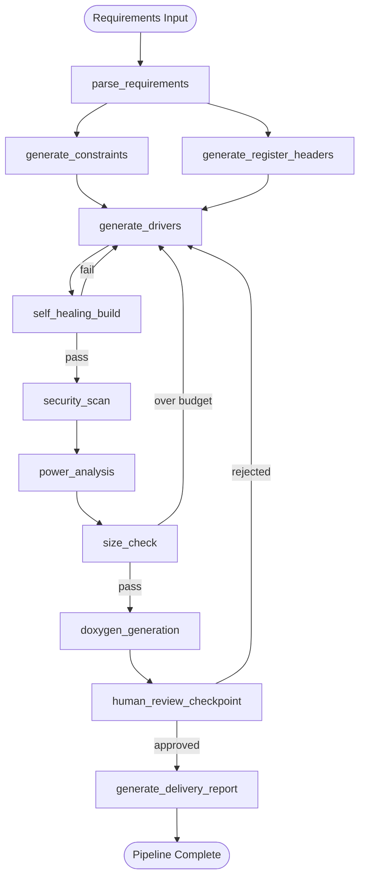

# Final Project - Firmware Intelligence Pipeline

> **Estimated effort:** 6-10 hours
> **Prerequisites:** All 14 labs completed

---

## Overview

Build an end-to-end **Firmware Intelligence Pipeline** that autonomously takes a high-level firmware specification and produces verified, documented, production-ready C code - validated against hardware constraints, security rules, power budgets, and ROM budgets - with a final Markdown delivery report.

This project integrates every major skill from the course: hardware-aware context, automated register mapping, latency optimization, self-healing builds, security scanning, power analysis, ReAct reasoning, agentic documentation, and constraint-based generation.

---

## Scenario

You are the lead firmware AI engineer at a startup building an IoT sensor node. The hardware team has handed you a single-page requirements document. Your job is to build an AI-powered pipeline that turns this document into production-ready firmware code in one automated run.

---

## Requirements Document (Input)

```
Product: Smart Temperature & Humidity Sensor Node
MCU: STM32L476RG (Cortex-M4F, 80 MHz, 1 MB Flash, 128 KB SRAM)
Power supply: CR2032 battery (240 mAh @ 3.0V)
Target battery life: 12 months minimum

Peripherals to initialize:
  1. I2C1 @ 400 kHz (Fast Mode) - connected to HDC2080 sensor at address 0x40
  2. USART2 @ 9600 baud, 8N1 - debug console (DISABLE in production builds)
  3. BLE (via SPI2 to external nRF52 module at 2 MHz) - send sensor data every 60 seconds

Operating mode:
  - Wake every 60 seconds (RTC wakeup from Stop2 mode)
  - Read HDC2080 temperature + humidity over I2C
  - Transmit reading over BLE (SPI2 to nRF52)
  - Return to Stop2 mode

Constraints:
  - Average current in Stop2 mode: must stay below 10 µA
  - Active window (60-second cycle): must complete in under 50 ms
  - ROM budget: drivers total ≤ 8 KB of Flash
  - No dynamic memory allocation
  - All peripheral ISRs in ITCM RAM
  - Firmware must pass buffer overflow and unsafe-function security scans
  - All public API functions must have Doxygen comments
```

---

## Deliverables

Your pipeline must produce all of the following:

### 1. Register Header Files

Generated C headers for all required peripheral registers:

- `i2c1_regs.h` - I2C1 control/status/data registers with bitfield structs
- `spi2_regs.h` - SPI2 control registers
- `usart2_regs.h` - USART2 control and baud rate registers
- `rtc_regs.h` - RTC wakeup timer registers

### 2. Driver Source Files

Constraint-compliant C drivers:

- `i2c1_driver.c / .h` - I2C Fast Mode, interrupt-driven, ≤ 1.5 KB ROM
- `spi2_driver.c / .h` - SPI master, DMA RX, ≤ 1 KB ROM
- `usart2_driver.c / .h` - Debug UART, `#if !PRODUCTION_BUILD` guarded, ≤ 512 bytes ROM
- `rtc_wakeup.c / .h` - Stop2 + RTC wakeup configuration, ≤ 512 bytes ROM
- `hdc2080.c / .h` - Sensor abstraction layer, ≤ 1 KB ROM
- `ble_nrf52.c / .h` - BLE adapter calling spi2_driver, ≤ 1 KB ROM
- `main.c` - Application main loop (wake → read → transmit → sleep)

### 3. Linker Script

`stm32l476.ld` with:

- `.itcm_text` section for all ISR handlers
- `.dtcm_data` section for lookup tables
- ROM budget assertions using `ASSERT(SIZEOF(.text) <= 8192, "ROM budget exceeded")`

### 4. Verification Reports

All generated automatically by the pipeline:

- `reports/security_scan.md` - buffer overflow + unsafe function scan results
- `reports/power_analysis.md` - active current budget vs. requirements
- `reports/size_report.md` - per-module ROM usage vs. budgets
- `reports/doxygen_coverage.md` - list of public functions without `@brief` comments

### 5. Pipeline Delivery Report

`DELIVERY_REPORT.md` - structured Markdown report with sections:

- Executive Summary
- Requirements Compliance Matrix
- Security Scan Results
- Power Budget Analysis
- ROM Budget Analysis
- Documentation Coverage
- Known Issues / Manual Review Items
- Build Instructions

---

## Architecture

Your pipeline must be implemented as a **LangGraph `StateGraph`** with the following nodes:



---

## Grading Criteria

| Category               | Points | Criteria                                                                                                |
| ---------------------- | ------ | ------------------------------------------------------------------------------------------------------- |
| **Register Headers**   | 15     | All 4 headers generated; bitfield structs compile clean; bit positions match STM32L4 RM                 |
| **Driver Quality**     | 25     | All 7 drivers compile for cortex-m4; no polling in production path; ISRs have ITCM section attribute    |
| **Self-Healing Build** | 10     | Pipeline self-corrects at least one compile error without human intervention                            |
| **Security Scan**      | 10     | Zero HIGH-severity findings in `security_scan.md`; all unsafe functions replaced                        |
| **Power Analysis**     | 10     | `power_analysis.md` mathematically demonstrates < 10 µA average in Stop2 duty cycle                     |
| **ROM Budget**         | 10     | `size_report.md` shows all modules within budget; linker ASSERT passes                                  |
| **Doxygen Coverage**   | 10     | Every public function has `@brief` + all `@param` + `@return`; doxygen_coverage.md shows 100%           |
| **Delivery Report**    | 10     | `DELIVERY_REPORT.md` has all 8 required sections; Requirements Compliance Matrix is complete            |
| **Pipeline Quality**   | 10     | LangGraph graph is correctly wired; human checkpoint works; max-iteration guard prevents infinite loops |

**Total: 110 points** (10 bonus points available for going beyond minimum requirements)

---

## Getting Started

### Step 1 - Set up the project structure

```bash
mkdir -p firmware-intelligence-pipeline/{src,include,linker,reports}
cd firmware-intelligence-pipeline
```

### Step 2 - Create the pipeline entry point

```python
# pipeline.py
from langgraph.graph import StateGraph, START, END
from typing_extensions import TypedDict
from typing import Optional, List, Dict

class PipelineState(TypedDict):
    requirements:        str
    parsed_requirements: Optional[dict]
    register_headers:    Dict[str, str]   # filename → content
    driver_sources:      Dict[str, str]   # filename → content
    constraints:         Dict[str, str]   # driver name → constraint block
    build_result:        Optional[dict]
    security_report:     Optional[str]
    power_report:        Optional[str]
    size_report:         Optional[str]
    doxygen_report:      Optional[str]
    review_status:       str
    delivery_report:     Optional[str]
    violations:          List[str]
    iteration_count:     int
```

### Step 3 - Implement each node

Refer to the relevant labs for implementation patterns:

| Node                        | Lab Reference                                       |
| --------------------------- | --------------------------------------------------- |
| `parse_requirements`        | Lab 001 (task scoping), Lab 014 (constraint blocks) |
| `generate_register_headers` | Lab 003 (automated register mapping)                |
| `generate_constraints`      | Lab 014 (constraint-based generation)               |
| `generate_drivers`          | Lab 007 (self-healing), Lab 009 (vibe coding)       |
| `self_healing_build`        | Lab 007 (self-healing workflows)                    |
| `security_scan`             | Lab 008 (security & safety)                         |
| `power_analysis`            | Lab 010 (power-sensitive refactoring)               |
| `size_check`                | Lab 014 (code size measurement)                     |
| `doxygen_generation`        | Lab 013 (agentic documentation)                     |
| `human_review_checkpoint`   | Lab 006 (LangGraph human-in-the-loop)               |
| `generate_delivery_report`  | Lab 005 (debugging reports as template)             |

### Step 4 - Run the pipeline

```bash
python pipeline.py --requirements requirements.txt --output-dir output/
```

### Step 5 - Verify deliverables

```bash
# Build check
arm-none-eabi-gcc -mcpu=cortex-m4 -mthumb -Wall output/src/*.c -Toutput/linker/stm32l476.ld -o output/firmware.elf
arm-none-eabi-size output/firmware.elf

# Security scan review
cat output/reports/security_scan.md | grep -i "high"   # Should be empty

# Doxygen check
doxygen output/Doxyfile 2>&1 | grep warning             # Should be empty
```

---

## Bonus Challenges

| Challenge             | Bonus Points | Description                                                                                 |
| --------------------- | ------------ | ------------------------------------------------------------------------------------------- |
| **QEMU Simulation**   | +5           | Run the compiled ELF in QEMU STM32 and verify I2C bus transactions appear in simulation log |
| **CI Pipeline**       | +3           | Add a GitHub Actions `.yml` that runs the full pipeline on every push                       |
| **Multi-MCU Support** | +2           | Make the register header generator work for both STM32L4 and STM32F4 from the same pipeline |

---

> **Back to [Tasks Index](../index.md)**
> 🎓 **Congratulations on completing the AgenticAI Firmware Course!**
